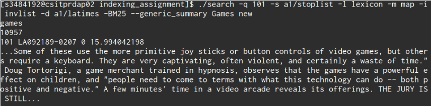

Information Retrieval Indexing Assignment
=========================================

This is an example of a search engine on the LA Times TREC Dataset.
Uses Okapi BM25 ranking and includes query summarisation.

Running the code
----------------

To run index, requires python2:

    ./index [-h] [-s <stopword_list>] [-p] <document_file>

Options can be done in any order.
-h will give clues about the different commandline options
-s is a flag for stating to use the following item as a stopword list
-p is a flag to print terms being indexed
   
To run search, requires python2:

    ./search -l <lexicon> -i <invlist> -m <map> queryterm [queryterm1...] [-BM25] 
        -q query_label [-s <stopwords>] [-n num_results] 
        [[--query_summary | --generic_summary] -d <doc_file>]

Options can be done in any order
- lexicon, invlist, map are mandatory files to be given 
- query_label must be given to label query
- num_results is defaulted to 10
- stopwords are optional
- if summarisation is done, doc_file must be given
- Query terms must be given

Authors
-------
Mazhar Morshed,
Dylan Aird
